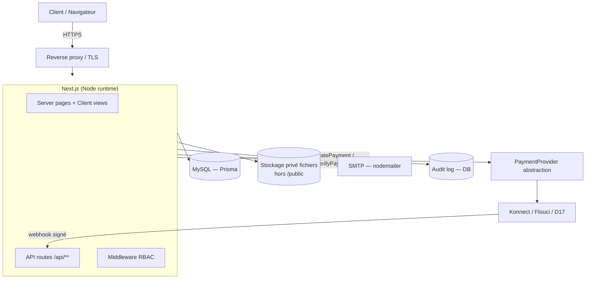
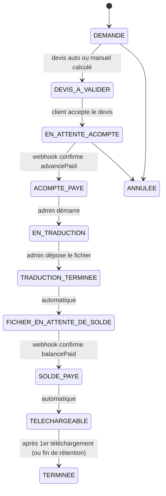

# Maître Makram Arfaoui — Plateforme de traduction juridique

Document de référence : **analyse du prototype**, **architecture cible**, **modèle de données** et **plan d'implémentation**. Rien n'est encore codé — ce document est le livrable de la Phase 1 + Phase 2 demandées avant toute écriture de code.

Le prototype fourni est conservé tel quel dans [`reference/original-prototype.html`](reference/original-prototype.html) pour référence visuelle.

---

## 1. Analyse du prototype actuel

### 1.1 Ce qui doit être conservé (identité visuelle)

C'est du bon travail de direction artistique, à garder comme base du design system :

- **Palette** : navy `#14284D`/`#0C1A34`, bleu `#2456B8`, or/bronze `#B4894E` (accent sceau), vert succès `#1E9E6A`, fond `#EDF0F5`. Cohérente avec le positionnement "cabinet juridique premium".
- **Typographie** : Spectral (serif, titres) + Inter (sans, corps) — bon contraste formel/lisible.
- **Topbar** : structure, logo/sceau SVG, nom + rôle, nav, CTA "Espace client", sticky + blur. À garder et seulement affiner (voir §3).
- **Hero** : proposition de valeur claire, visuel "document source → document traduit + sceau + badge verrouillé". Bon concept, à reproduire avec de vraies images/illustrations en prod.
- **Workflow en 5 étapes** avec le marquage "Acompte 50 %" / "🔒 Fichier verrouillé" / "🔓 Débloqué" : c'est exactement le bon modèle mental à garder pour l'espace client réel.
- **Filebox verrouillé/déverrouillé** (`§45` du brief) : le pattern visuel (icône cadenas, blur, chip, CTA "Payer le solde") est bon et sera repris à l'identique, simplement piloté par un vrai état serveur.
- Cartes services, palette de statuts, modal de paiement (structure, pas le comportement).

### 1.2 Ce qui est une maquette et doit être jeté (anti-patterns de sécurité/architecture)

| Élément du prototype | Pourquoi c'est disqualifiant en production |
|---|---|
| `var orders = []` — état en mémoire JS, perdu au refresh | Aucune persistance, aucune source de vérité serveur |
| `SERVICES` avec `price: 25/30/35/40` codés en dur dans le `<script>` | Violation directe de §5/§57 : les prix doivent être administrables en DB |
| `$("#payConfirm")` → `setTimeout(..., 900)` → `afterAdvance()` | **Le paiement est simulé côté navigateur.** N'importe qui peut appeler `afterAdvance(id)` depuis la console et débloquer sa commande. C'est le problème n°1 identifié en §11/§60/§55 |
| `function deliver(id){ o.delivered=true; ... }` déclenché par un bouton "Simuler : le traducteur dépose le fichier" côté client | Le dépôt du fichier final doit venir d'une action admin authentifiée côté serveur, jamais du navigateur du client |
| `function download(id){ ... new Blob(...) }` — génère un `.txt` factice en JS | Aucun vrai fichier, aucun contrôle d'accès : dans le prototype, un client peut "télécharger" sans jamais avoir payé le solde (le bouton est juste `disabled` visuellement tant que `status!=="ready"`, mais rien n'empêche d'appeler `download(id)` directement) |
| Aucune authentification | Pas de notion d'utilisateur, donc pas d'IDOR possible mais aussi pas de vraie isolation des commandes par client |
| Aucun backend, aucune DB | Tout est reconstruit à chaque rechargement de page |

**Conclusion de l'analyse** : l'UI/UX est réutilisable à ~80 %, la logique JS (`<script>` de 300 lignes) est à 100 % jetable. C'est une démo de comportement, pas une base de code.

---

## 2. Stack technique retenue

Comme convenu : **Next.js 15 (App Router) + TypeScript + Prisma + MySQL + NextAuth v5**, en suivant les mêmes conventions que le projet calmatrip (page/view split, repositories, schemas Zod, rate limiting maison) — stack déjà éprouvée dans ce contexte, un seul déploiement full-stack.

```text
Frontend + Backend  : Next.js 15 App Router (Node runtime, pas Edge — pour bcrypt/argon2 et accès fichiers privés)
ORM                 : Prisma → MySQL 8
Auth                : NextAuth v5 (Credentials + argon2id), JWT + re-lecture rôle en DB à chaque session
Validation           : Zod (schemas partagés client/serveur)
Stockage documents   : disque privé HORS `public/` + route API authentifiée qui stream les octets (voir §5)
Paiement             : abstraction `PaymentProvider` (voir §6), providers réels branchés en Phase 8
Mail                 : nodemailer SMTP (comme calmatrip)
Tests                : Vitest (schemas, repositories, state machine, autorisation) + Playwright pour le parcours E2E paiement
i18n                 : dictionnaire FR/AR/EN + `dir="rtl"` sur les pages arabes
```

### 2.1 Diagramme d'architecture



### 2.2 Structure de dossiers (miroir des conventions calmatrip)

```text
src/
  app/
    (public)/                    page.tsx = shell léger, metadata via buildMetadata()
      page.tsx                   Home
      services/[slug]/page.tsx   pages SEO par service
      a-propos/, contact/, faq/
    (auth)/login/, register/, forgot-password/, reset-password/
    dashboard/                   espace client
      page.tsx                  KPI + graphique
      orders/page.tsx
      orders/[id]/page.tsx
    admin/                       espace traducteur/admin (RBAC ADMIN|TRANSLATOR)
      orders/page.tsx
      orders/[id]/page.tsx
    api/
      auth/[...nextauth]/route.ts
      auth/register/route.ts
      services/route.ts
      orders/route.ts
      orders/[id]/route.ts
      orders/[id]/documents/route.ts
      orders/[id]/documents/[documentId]/download/route.ts
      orders/[id]/payment/advance/route.ts
      orders/[id]/payment/balance/route.ts
      payments/webhook/route.ts
      admin/orders/[id]/quote/route.ts
      admin/orders/[id]/status/route.ts
      admin/orders/[id]/document/route.ts
  views/                         toute la logique UI, comme calmatrip
    admin/
  repositories/                  seule couche qui touche prisma
    orders.ts, payments.ts, services.ts, documents.ts, users.ts, auditLog.ts
  schemas/                       Zod + *.test.ts à côté
  lib/
    prisma.ts
    auth.ts
    rateLimit.ts
    sanitize.ts
    seo.ts
    payments/
      provider.ts                interface PaymentProvider
      konnect.ts (ou flouci.ts)  implémentation réelle
      mock.ts                    implémentation staging/dev
    storage/
      privateStorage.ts          écriture/lecture disque privé + resolution de clé sûre
    notifications.ts, mail.ts
    money.ts                     helpers Decimal / millimes entiers
  types/
prisma/
  schema.prisma
  migrations/
```

---

## 3. Topbar — ce qui change concrètement

Conservé : structure, logo, libellés (Services / Comment ça marche / Commander / Suivi / Contact / Espace client), sticky + blur.

Affiné :
- **Accessibility** : `aria-current="page"` sur le lien de section active (scroll-spy via `IntersectionObserver`), focus visible déjà correct à garder, `role="dialog"` + trap de focus sur le menu mobile (actuellement un simple `classList.toggle`).
- **Le CTA "Espace client"** doit pointer vers `/login` si non connecté, `/dashboard` si connecté (comportement dynamique, plus un simple `#espace`).
- **"Commander" et "Suivi"** pointaient tous les deux vers `#espace` dans le prototype (même ancre) — en prod ce sont deux vraies routes distinctes : `/commander` (wizard, §47) et `/dashboard/orders` (nécessite login).
- Mobile menu : remplacer le panneau qui pousse le contenu par un `<dialog>` ou overlay avec `inert` sur le reste de la page, fermeture au `Escape`.
- Perf : le `backdrop-filter: blur(10px)` sticky est correct, RAS.

---

## 4. Modèle de données (Prisma — schéma cible)

Points clés : montants en `Decimal(10,3)` (le millime tunisien a 3 décimales, jamais `Float`), prix figés en snapshot sur la commande, historique de statut append-only, paiements idempotents par référence provider unique.

```prisma
enum Role {
  CLIENT
  TRANSLATOR
  ADMIN
}

enum OrderStatus {
  DEMANDE
  DEVIS_A_VALIDER
  EN_ATTENTE_ACOMPTE
  ACOMPTE_PAYE
  EN_TRADUCTION
  TRADUCTION_TERMINEE
  FICHIER_EN_ATTENTE_DE_SOLDE
  SOLDE_PAYE
  TELECHARGEABLE
  TERMINEE
  ANNULEE
}

enum PaymentPhase { ADVANCE BALANCE }
enum PaymentStatus { PENDING SUCCEEDED FAILED REFUNDED }
enum DocumentKind { SOURCE TRANSLATED }
enum DocumentStatus { UPLOADED SCANNING READY REJECTED }

model User {
  id            String   @id @default(cuid())
  email         String   @unique
  passwordHash  String?
  role          Role     @default(CLIENT)
  firstName     String
  lastName      String
  phone         String?
  emailVerified DateTime?
  orders        Order[]
  auditLogs     AuditLog[]
  createdAt     DateTime @default(now())
}

model Service {
  id          String   @id @default(cuid())
  slug        String   @unique
  name        String
  description String   @db.Text
  pricePerPage Decimal @db.Decimal(10,3)   // 0 = "sur devis"
  active      Boolean  @default(true)
  orders      Order[]
}

model PricingRule {
  id        String   @id @default(cuid())
  key       String   @unique   // "delay.express", "delay.urgent", "certification.fee"
  label     String
  multiplier Decimal? @db.Decimal(6,3)
  flatFee    Decimal? @db.Decimal(10,3)
  active    Boolean  @default(true)
}

model Order {
  id              String      @id @default(cuid())
  reference       String      @unique          // "CMD-2026-00124"
  userId          String
  user            User        @relation(fields:[userId], references:[id])
  serviceId       String
  service         Service     @relation(fields:[serviceId], references:[id])
  sourceLang      String
  targetLang      String
  pages           Int
  delayKey        String                        // snapshot de la clé PricingRule utilisée
  status          OrderStatus @default(DEMANDE)

  // Snapshot financier — jamais recalculé rétroactivement
  totalAmount     Decimal     @db.Decimal(10,3)
  advanceAmount   Decimal     @db.Decimal(10,3)
  balanceAmount   Decimal     @db.Decimal(10,3)
  advancePaid     Boolean     @default(false)
  balancePaid     Boolean     @default(false)

  documents       Document[]
  payments        Payment[]
  statusHistory   OrderStatusHistory[]
  createdAt       DateTime    @default(now())
  updatedAt       DateTime    @updatedAt

  @@index([userId])
  @@index([status])
}

model OrderStatusHistory {
  id        String      @id @default(cuid())
  orderId   String
  order     Order       @relation(fields:[orderId], references:[id])
  status    OrderStatus
  actorId   String?     // null = système (ex. webhook)
  note      String?
  createdAt DateTime    @default(now())
}

model Document {
  id          String         @id @default(cuid())
  orderId     String
  order       Order          @relation(fields:[orderId], references:[id])
  kind        DocumentKind
  status      DocumentStatus @default(UPLOADED)
  storageKey  String         @unique   // chemin relatif dans le stockage privé, nom aléatoire
  originalName String                  // conservé pour affichage uniquement, jamais utilisé comme chemin
  mimeType    String
  sizeBytes   Int
  sha256      String
  uploadedById String
  createdAt   DateTime       @default(now())
}

model Payment {
  id            String        @id @default(cuid())
  orderId       String
  order         Order         @relation(fields:[orderId], references:[id])
  phase         PaymentPhase
  status        PaymentStatus @default(PENDING)
  amount        Decimal       @db.Decimal(10,3)
  currency      String        @default("TND")
  provider      String                          // "konnect" | "flouci" | "mock"
  providerRef   String        @unique            // idempotence : jamais deux fois la même transaction
  rawPayload    Json?                             // payload webhook brut, pour audit
  createdAt     DateTime      @default(now())
  confirmedAt   DateTime?
}

model AuditLog {
  id        String   @id @default(cuid())
  actorId   String?
  action    String                              // "ORDER_CREATED", "BALANCE_PAYMENT_CONFIRMED", ...
  resource  String                              // "order:CMD-2026-00124"
  metadata  Json?
  ip        String?
  createdAt DateTime @default(now())
  user      User?    @relation(fields:[actorId], references:[id])
}
```

`Notification`, `CustomerProfile` (si des champs client additionnels s'avèrent nécessaires) seront ajoutés en Phase 5/12 sans changer la structure ci-dessus.

---

## 5. Sécurité des documents (le point non-négociable du brief)

**Écart avec la convention calmatrip à noter explicitement** : calmatrip sert ses uploads en `public/uploads/` car ce sont des images de produits/annonces (public par nature). Ici, les documents sont des **actes juridiques personnels** — ce modèle est inapplicable et **ne sera pas réutilisé**.

Flux retenu :

```text
Upload → validation (MIME réel via magic bytes, taille, extension) →
  nom aléatoire (UUID) → écrit dans un dossier HORS de /public (ex. STORAGE_ROOT env var,
  hors du webroot) → hash SHA-256 stocké → entrée Document en DB

Téléchargement → GET /api/orders/:id/documents/:documentId/download
  1. session valide (auth())
  2. order.userId === session.user.id  (sinon 403 — bloque IDOR/BOLA du §23/§43)
  3. si kind === TRANSLATED : order.balancePaid === true (sinon 403, message "solde requis")
  4. document.status === READY
  5. lecture du fichier par storageKey résolu de façon path-traversal-safe (jamais à partir
     d'un input utilisateur brut) et stream de la réponse avec Content-Disposition
  6. AuditLog "DOCUMENT_DOWNLOADED"
```

Pas de bucket S3 nécessaire au lancement (VPS avec disque persistant, comme calmatrip) : un dossier privé + un contrôle d'accès strict au niveau de la route API suffit et respecte l'esprit de la section 14 (le point non négociable est "jamais d'URL publique directe", pas "obligatoirement un cloud object storage"). Si le volume ou le besoin de CDN augmente plus tard, la même interface `privateStorage.ts` pourra pointer vers S3-compatible sans changer les routes.

---

## 6. Paiement 50/50 — state machine et abstraction provider

### 6.1 Règle d'or (rappel du §11/§63)
Le frontend ne fait jamais `paid = true`. Il demande un paiement au backend, qui appelle le provider ; **seul le webhook signé du provider, vérifié côté serveur, fait passer `advancePaid`/`balancePaid` à `true`**.

### 6.2 Interface

```ts
// lib/payments/provider.ts
interface PaymentProvider {
  createPayment(input: { orderId: string; phase: "ADVANCE"|"BALANCE"; amount: Decimal; currency: "TND" }): Promise<{ redirectUrl: string; providerRef: string }>;
  verifyPayment(providerRef: string): Promise<PaymentStatus>;
  handleWebhook(rawBody: Buffer, signatureHeader: string): Promise<WebhookEvent>; // throws si signature invalide
  refundPayment(providerRef: string): Promise<void>;
  getPaymentStatus(providerRef: string): Promise<PaymentStatus>;
}
```

`mock.ts` (dev/staging uniquement, jamais monté en prod) simule un provider avec un vrai aller-retour serveur (pas de `setTimeout` frontend) pour permettre de développer/tester tout le pipeline avant d'avoir un compte marchand réel.

### 6.3 State machine des statuts de commande



### 6.4 Webhook (`POST /api/payments/webhook`)

1. Vérifier la signature (secret côté serveur, jamais exposé au frontend).
2. Charger le `Payment` par `providerRef` — si déjà `SUCCEEDED`, **no-op** (idempotence, couvre le "Cas 4" du §42).
3. Revérifier le montant reçu contre `order.advanceAmount`/`balanceAmount` en DB (jamais celui du payload seul) — "Cas 5".
4. Revérifier la devise (`TND`).
5. Enregistrer `Payment.status = SUCCEEDED`, `confirmedAt`.
6. Mettre à jour `Order.advancePaid`/`balancePaid` + transition de statut + `OrderStatusHistory`.
7. Si `balancePaid` devient vrai : passer les `Document(kind=TRANSLATED)` à disponibles pour téléchargement.
8. Notifier le client (email).
9. `AuditLog`.

Toute l'opération 3-9 dans une transaction Prisma.

---

## 7. RBAC & autorisation

- Rôles `CLIENT` / `TRANSLATOR` / `ADMIN` sur `User.role`, même pattern que calmatrip (relecture DB à chaque session, pas de confiance au JWT seul).
- Middleware : `/dashboard/**` → CLIENT connecté ; `/admin/**` → TRANSLATOR ou ADMIN ; redirections croisées comme dans calmatrip.
- Chaque route `/api/orders/:id/**` vérifie systématiquement `order.userId === session.user.id` **avant** toute lecture/écriture (sauf routes `/api/admin/**` qui vérifient le rôle à la place) — c'est le contrôle qui manque totalement dans le prototype et qui est explicitement exigé en §23/§55.

---

## 8. Plan d'implémentation (phases réalistes, dérivées du §62)

| Phase | Contenu | Sortie vérifiable |
|---|---|---|
| **1. Scaffold** | `create-next-app`, Prisma init, structure de dossiers ci-dessus, design tokens (palette/typo du prototype en CSS/Tailwind), `.env.example` | Projet qui build, page d'accueil statique avec le nouveau topbar |
| **2. Auth** | NextAuth Credentials + argon2id, register/login/logout, cookies HttpOnly/Secure/SameSite, verification email, forgot/reset password | Test E2E : inscription → email → login → session persistée |
| **3. Services & pricing admin** | CRUD `Service`/`PricingRule` (admin uniquement), page publique `/services` qui lit ces données (plus aucun prix en dur) | Changer un prix en DB change l'affichage sans redeploy |
| **4. Wizard de commande** | Étapes du §47 (document → langues → service → délai → coordonnées → résumé), upload sécurisé (MIME réel, UUID, stockage privé), calcul devis backend | Une commande `DEMANDE` créée en DB avec `Document(kind=SOURCE)` |
| **5. Devis** | Auto (formule) + override manuel admin, snapshot des montants sur `Order`, écran client "Accepter et payer l'acompte" | `DEVIS_A_VALIDER` → `EN_ATTENTE_ACOMPTE` |
| **6. Paiement (mock provider)** | Abstraction `PaymentProvider`, provider mock avec vrai aller-retour serveur, webhook, state machine complète, idempotence | Suite de tests "Payment tests" du §42 qui passent (double webhook, montant invalide, etc.) |
| **7. Espace client (dashboard)** | KPI cards, graphique (Recharts), liste des commandes, page détail + timeline | Empty/loading/error states couverts |
| **8. Fichier verrouillé/déverrouillé + téléchargement sécurisé** | UI filebox reprise du prototype, route de téléchargement avec les 5 vérifications du §5, URL signée à courte durée de vie | Test : client A ne peut pas télécharger le fichier de la commande de client B, ni avant paiement du solde |
| **9. Espace admin/traducteur** | Table des commandes + filtres, changement de statut, dépôt du fichier final, consultation paiements | Traducteur peut faire progresser une commande de bout en bout |
| **10. Notifications** | `NotificationService` (email d'abord), tous les événements du §29 | Chaque transition envoie le bon email |
| **11. Provider de paiement réel** | Intégration Konnect (ou Flouci/D17 selon le compte marchand disponible), signature webhook réelle | *Dépend d'un compte marchand actif — voir §9 "dépendances externes"* |
| **12. Sécurité transverse** | Rate limiting (login/register/upload/payment), headers CSP/HSTS/etc., sanitisation HTML, audit log complet, RGPD (pages légales + politique de rétention) | Checklist §59 "Security" cochée |
| **13. SEO & i18n** | Pages `/services/[slug]`, metadata, JSON-LD, sitemap/robots, FR/AR (RTL)/EN | Lighthouse SEO ≥ 95 |
| **14. Tests** | Vitest (schemas/repositories/state machine), Playwright (parcours E2E complet du §41, y compris le cas IDOR) | CI verte |
| **15. Docker + CI/CD** | Dockerfile app + MySQL, pipeline lint/test/build/deploy staging | Déploiement staging automatisé |
| **16. Production** | TLS, monitoring, backups testés (restauration réelle), déploiement prod | Checklist §59 complète |

Chaque phase est livrée testée avant de passer à la suivante — pas de "big bang" en fin de projet.

---

## 9. Dépendances externes et décisions encore ouvertes

Ces points ne peuvent pas être tranchés par l'ingénierie seule :

1. **Compte marchand de paiement** : Konnect, Flouci et/ou D17 nécessitent chacun une inscription business et des clés API réelles côté Maître Arfaoui. Le développement peut avancer avec le provider `mock` jusqu'à ce qu'un compte soit disponible (Phase 11 seulement).
2. **Politique de rétention des documents** (§27) : durée de conservation des documents source/traduits, à définir avec le professionnel (obligations déontologiques d'un traducteur assermenté en Tunisie) — impacte un job de purge automatique.
3. **Hébergement cible** : VPS dédié (comme calmatrip) supposé par défaut pour le stockage disque privé des documents ; à confirmer avant la Phase 16.
4. **Contenu réel des pages légales** (CGU, politique de confidentialité) : à rédiger avec/par un professionnel, l'ingénierie ne fait que les intégrer.
5. **Textes AR/EN** : traduction réelle des contenus SEO (§33 exige une vraie localisation, pas une traduction de boutons) — probablement à faire relire par Maître Arfaoui lui-même vu le domaine.

---

## 10. Prochaine étape

Dès validation de ce document, la Phase 1 (scaffold) peut démarrer dans `C:\Works\makram-arfaoui` : `create-next-app`, Prisma, et migration du design system (palette/typo/topbar) du prototype vers de vrais composants React.
